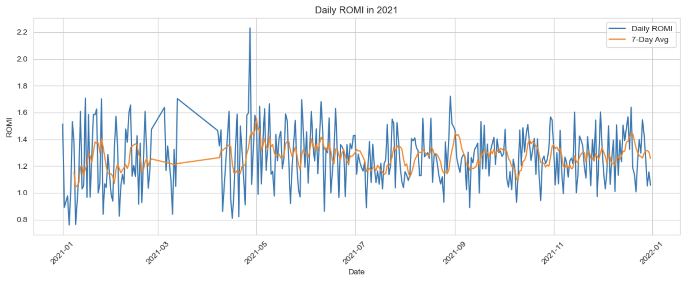
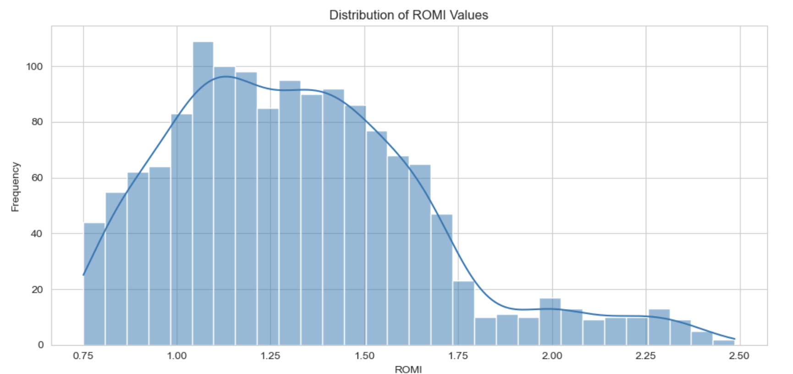
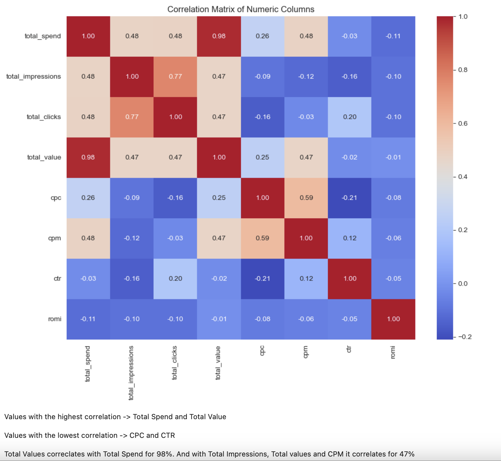

# Facebook Ads Performance Analysis

This project analyzes Facebook ad campaign data to uncover insights about daily marketing performance, return on investment, and campaign-level effectiveness.

---

## Data & Schema

**Source file:**
- `facebook_ads_data.csv` – Daily metrics from multiple Facebook advertising campaigns in 2021–2022.

**Challenges:**
- Data needed to be filtered to focus on the 2021 calendar year.
- Aggregations were required to compare performance across different dates.

### Sample Ad Data (Partial View)

  

---

## Python Analysis

The following tasks were completed using Python (Pandas, Seaborn, Matplotlib) in a Jupyter Notebook:

- What is the daily advertising spend and ROMI (Return On Marketing Investments) throughout 2021?
- How do those values behave when plotted with a 7-day rolling average?
- What are the total spend and ROMI per campaign?
- What does the daily ROMI distribution look like across campaigns?
- What is the overall distribution of ROMI values?
- What are the correlations between numeric advertising metrics?
- How strong is a relationship between spend and value?

---

## Code

All logic is implemented in this Jupyter notebook:  
[Facebook Ads ROMI Analysis.ipynb](./Facebook_Ads_ROMI.ipynb)

Key techniques include:

- Dataset filtering and time-based slicing
- Grouping and aggregation by date
- Use of rolling averages for smoothing trends
- Plotting with Seaborn: bar plots, box plots, histogram, regression, and heatmap

---

## Selected Results

### Daily ROMI trend with rolling average

  

### ROMI by campaign

  

### ROMI distribution histogram

  

### Correlation heatmap of numeric metrics

  

---

## Summary

This project demonstrates the use of Python for real-world marketing data analysis. It highlights techniques in grouping, filtering, rolling averages, and exploratory visualization — all used to evaluate how advertising spend translates into value.

A key focus was on **ROMI (Return on Marketing Investment)**, calculated as: ROMI = Total Value / Total Spend
By analyzing daily and campaign-level performance, this project provides actionable insights into ad efficiency and marketing return.
